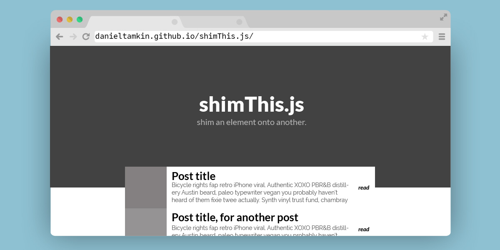

# shimThis.js
a simple jQuery plugin to "Shim" an element onto another.


[_(demo)_](danieltamkin.github.io/shimThis.js/)
### Settings

ontop: _element to be shimmed on_
```
$("#site-shim").shimThis({
  ontop: 'section.hero',
});
```
offset: _offset of shim_
```
$("#site-shim").shimThis({
  offset: '400px',
});
```

_can be combined_
```
<script>
  $offset = $("section.body").outerHeight();
  $("#site-shim").shimThis({
    ontop: 'section.hero',
    offset: $offset+'px'
  });
</script>
```
